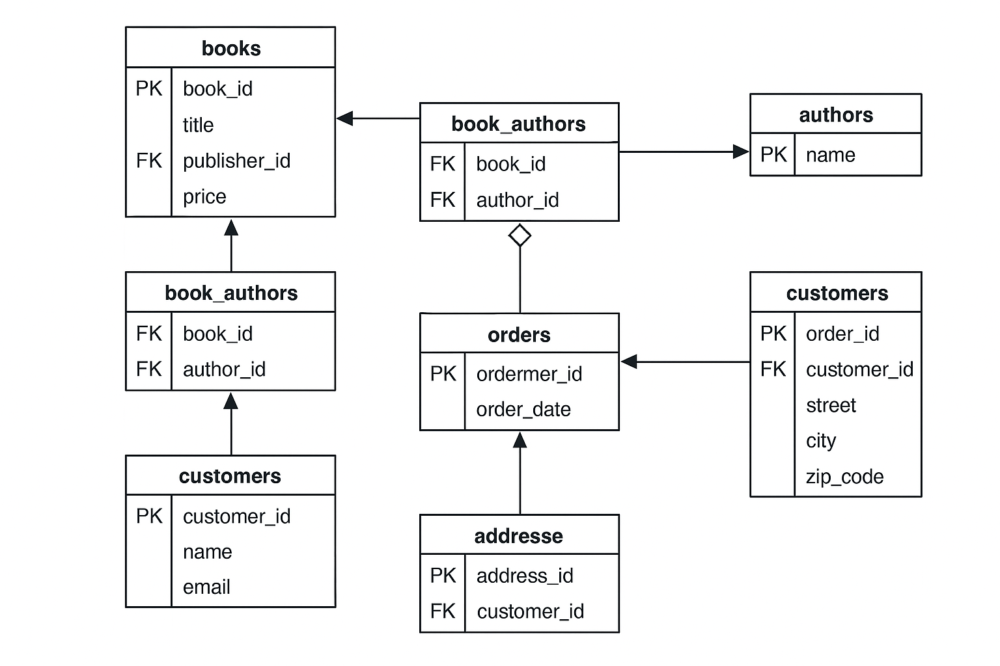

# Groupwork No. Myself yes.
# Bookstore Database Project

This project is a MySQL-based relational database system designed to manage and store data for a bookstore. It includes tables for managing books, authors, customers, orders, and shipping.

## 📘 Project Overview

This database supports:
- Managing inventory of books and authors
- Customer profiles and multiple address support
- Order placement, status tracking, and history
- Shipping methods and logistics
- User access and role management

## 🧱 Tables

The database includes the following core tables:
- `book`
- `author`
- `book_author`
- `book_language`
- `publisher`
- `book_author`
- `customer`
- `customer_address`
- `address_status`
- `address`
- `country`
- `cust_order`
- `order_line`
- `shipping_method`
- `order_history`
- `order_status`

## 🔗 Entity-Relationship Diagram

Below is the ER diagram showing the relationships between tables:

## 🛠️ Tools Used

- **MySQL** – For database design and queries
- **Draw.io** – For ER diagram design
- **Markdown** – For documentation

## 🚀 How to Use

1. Import the ER diagram image or open the `.drawio` file with [Draw.io](https://app.diagrams.net).
2. Run SQL scripts to create the schema.
3. Load sample data for testing.
4. Use SQL queries to retrieve and analyze bookstore data.

## 📂 Files Included

- `bookstore_er_with_relationships.drawio` – Editable ER diagram
- `A_diagram_in_the_image_depicts_an_Entity-Relations.png` – Image version of the diagram
- `README.md` – Project documentation (this file)
